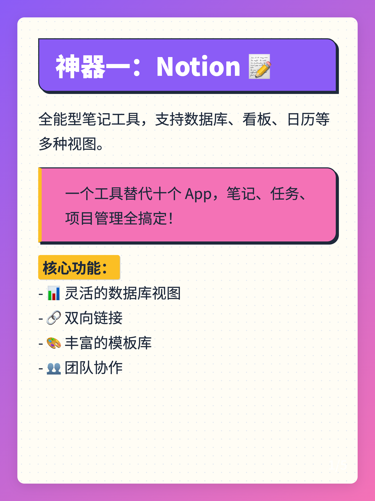
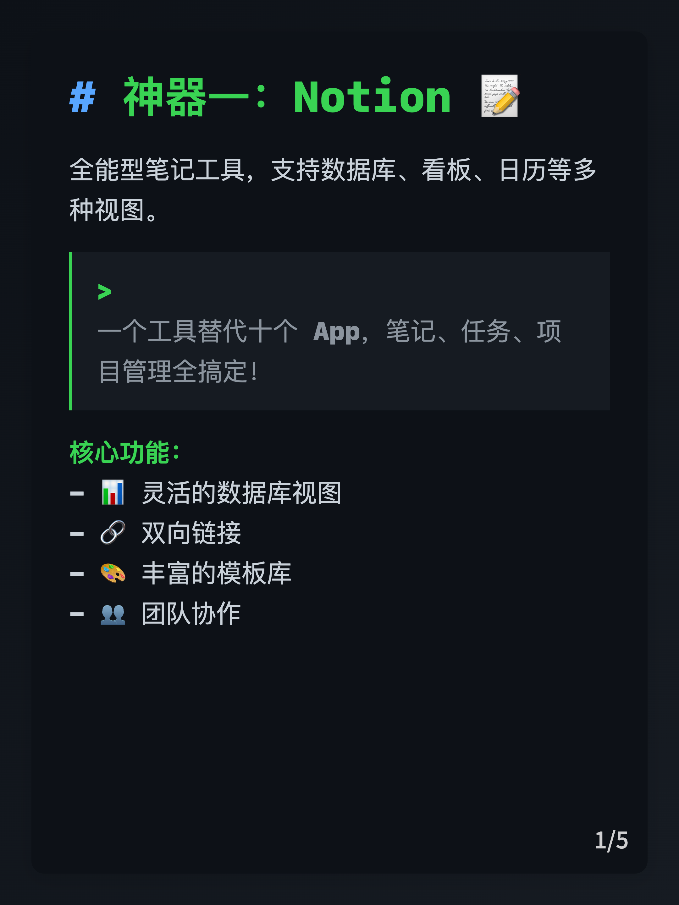
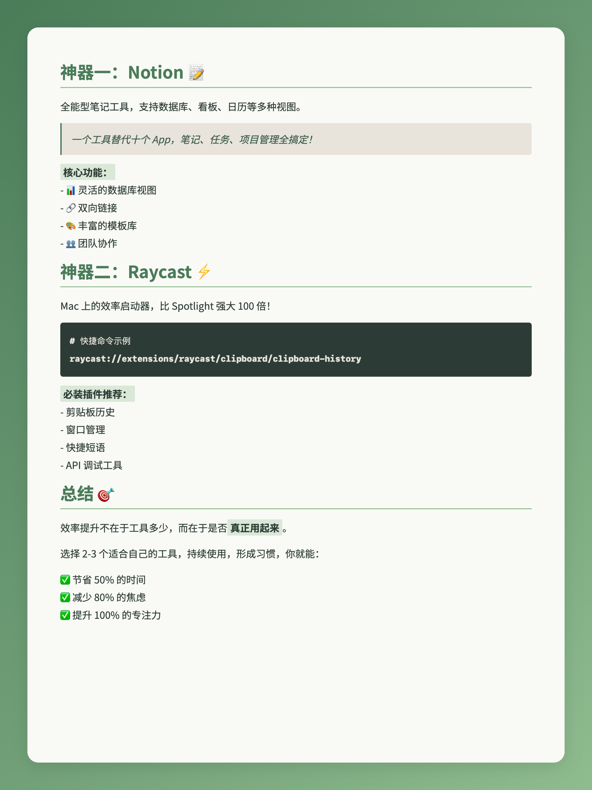

## 📕 Auto-Redbook-Skills


## ✨ 项目亮点

- **🎨 8 套主题皮肤**：默认简约灰 + Playful Geometric / Neo-Brutalism / Botanical / Professional / Retro / Terminal / Sketch
- **📐 4 种分页模式**：
  - `separator`：按 `---` 分隔手动分页
  - `auto-fit`：固定尺寸，自动整体缩放内容，避免溢出/大面积留白
  - `auto-split`：根据渲染后高度自动拆分为多张卡片
  - `dynamic`：根据内容动态调整图片高度
- **🧱 统一卡片结构**：外层浅灰背景（`card-container`）+ 内层主题背景（`card-inner`）+ 纯排版层（`card-content`）
- **🧠 封面与正文一体化**：封面背景、标题渐变和正文卡片背景都按主题自动匹配

---

## 主题效果示例

> 所有示例均为 1080×1440px，小红书推荐 3:4 比例
> 更多示例去 [demo](/demos) 中查看  

|||
|---|---|
|||
|||

### Auto-fit 模式示例（自动缩放）



---

## 🚀 使用方式总览

### 1. 克隆项目

```bash
git clone https://github.com/comeonzhj/Auto-Redbook-Skills.git
cd Auto-Redbook-Skills
```

可以将本项目放到支持 Skills 的客户端目录，例如：

- Claude：`~/.claude/skills/`
- Alma：`~/.config/Alma/skills/`
- TRAE：`/your-path/.trae/skills/`

### 2. 安装依赖


**Node.js：**

```bash
cd ./scripts
npm i
```

---


## 🎨 渲染图片（Node.js）

脚本：`scripts/render_xhs.js`：

**主要参数：**

| 参数 | 简写 | 说明 |
|------|------|------|
| `--theme` | `-t` | 主题：`default`、`playful-geometric`、`neo-brutalism`、`botanical`、`professional`、`retro`、`terminal`、`sketch` |
| `--mode` | `-m` | 分页模式：`separator` / `auto-fit` / `auto-split` / `dynamic` |
| `--width` | `-w` | 图片宽度（默认 1080） |
| `--height` |  | 图片高度（默认 1440，`dynamic` 为最小高度） |
| `--max-height` |  | `dynamic` 模式最大高度（默认 2160） |
| `--dpr` |  | 设备像素比，控制清晰度（默认 2） |

> 生成结果会包含：
> - 图片：`cover.png`、`card_1.png`、`card_2.png`...
> - 中间 HTML：`cover.html`、`card_1.html`、`card_2.html`...

---

```bash
# 默认主题 + 手动分页
node scripts/render_xhs.js demos/content.md

# 指定主题 + 自动分页
node scripts/render_xhs.js demos/content.md -t terminal -m auto-split

# 指定主题 + 输出
node scripts/render_xhs.js demos/content.md -t neo-brutalism  -o out-neo-brutalism 
```

### Markdown Frontmatter（页脚配置）

```yaml
---
emoji: "🚀"
title: "封面大标题"
subtitle: "封面副标题"
author: "你的名字"
slogan: "@xxx 和我一起进步"
img_max_width: 80
---
```

- `author`：正文页脚左侧文案
- `slogan`：正文页脚右侧文案
- `img_max_width`：正文图片最大宽度百分比（默认 `80`，可写 `70` 或 `70%`）
- 页脚中间自动显示页码（例如 `1/4`），封面不显示页脚

### Markdown 图片路径规则

- Markdown 中图片支持正常渲染
- 相对路径按 `--output-dir` 作为基准目录解析
- 例如：`` 会解析为 `<output-dir>/images/demo.png`

### Iconify 图标支持

- 正文卡片已通过 CDN 引入 Iconify
- 可在 Markdown 中直接写图标标签，例如：

```html
<iconify-icon icon="mdi:rocket-launch"></iconify-icon>
```

---


## 📁 项目结构

```bash
Auto-Redbook-Skills/
├── SKILL.md              # 技能描述（Agent 使用说明）
├── README.md             # 项目文档（你现在看到的）
├── requirements.txt      # Python 依赖
├── package.json          # Node.js 依赖
├── env.example.txt       # Cookie 配置示例
├── references/           # 技能参考文档
│   └── params.md         # 完整参数参考（主题/模式/发布参数）
├── assets/
│   ├── cover.html        # 封面 HTML 模板
│   ├── card.html         # 正文卡片 HTML 模板
│   ├── styles.css        # 共用容器样式（cover-inner / card-inner 等）
│   └── example.md        # 示例 Markdown
├── assets/themes/        # 主题样式（只控制排版 & 内层背景）
│   ├── default.css
│   ├── playful-geometric.css
│   ├── neo-brutalism.css
│   ├── botanical.css
│   ├── professional.css
│   ├── retro.css
│   ├── terminal.css
│   └── sketch.css
├── demos/                # 各主题示例渲染结果
│   ├── content.md
│   ├── content_auto_fit.md
│   ├── auto-fit/
│   ├── playful-geometric/
│   ├── retro/
│   ├── Sketch/
│   └── terminal/
└── scripts/
    ├── render_xhs.js     

```


---

## 🙏 致谢

- [Playwright](https://playwright.dev/) - 浏览器自动化渲染
- [Marked](https://marked.js.org/) - Markdown 解析
- [xhs](https://github.com/ReaJason/xhs) - 小红书 API 客户端
- **Cursor** - 本次重构过程中提供了极大帮助 ❤️

---

## 📄 License

MIT License © 2026
